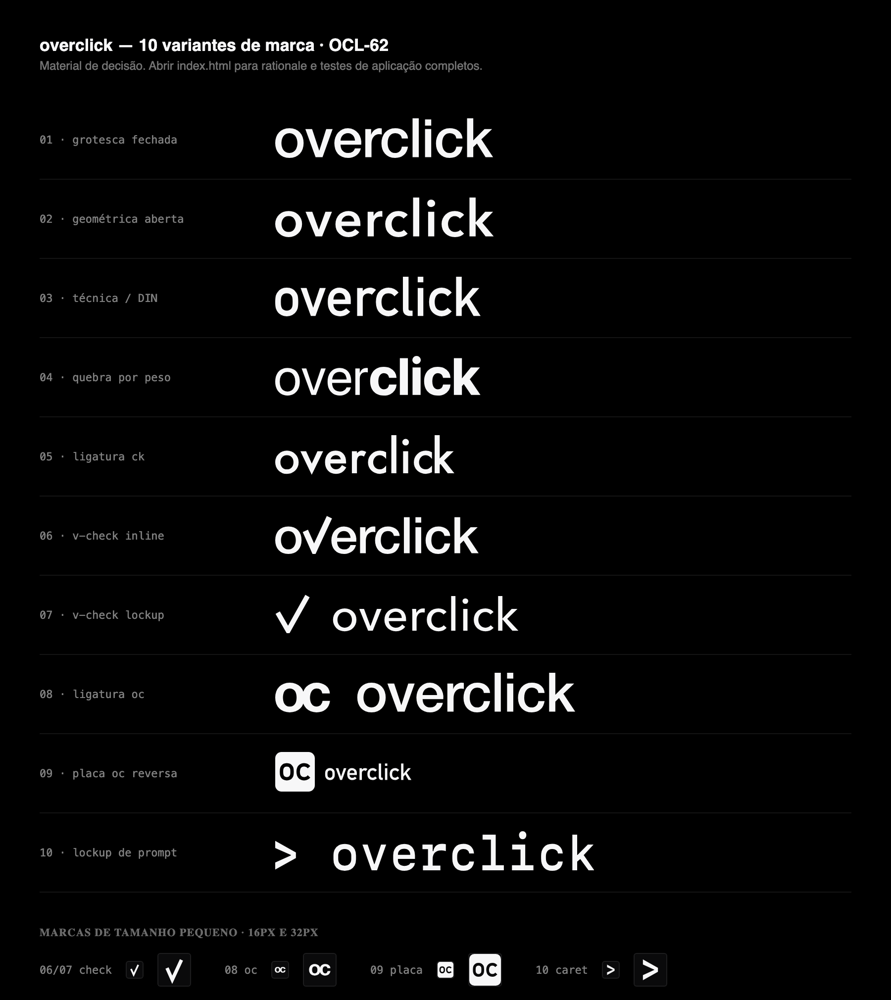

# pilotdeck — 10 variantes de marca (OCL-62)

> **Material de decisão, não produção.** Nada aqui está aplicado ao app. O dono abre
> [`index.html`](./index.html), aponta uma variante (ou um sistema), e o card seguinte
> refina a escolhida e troca topbar + favicon.

Terceira rodada da identidade, a primeira com método: processo da skill `logo-design`
(rampstackco/claude-skills), doutrina de [`../ux-v2.md`](../ux-v2.md), e
[`../brand.md`](../brand.md) lido como **registro do que foi reprovado**.



```
docs/design/logo-variants/
├── index.html          ← ABRIR ESTE. As 10 variantes lado a lado, com os testes de aplicação.
├── contact-sheet.png   ← quick look das 10 (o preview acima), pra ler o card sem abrir o HTML
├── README.md           ← este arquivo: a spec escrita
├── svg/                ← 16 SVGs fonte (10 marcas primárias + alternativas e símbolos)
└── tools/
    ├── generate.py     ← a geometria de todas as marcas
    └── preview.py      ← monta o index.html
```

---

## O que esta rodada não repete

O OCL-37 foi reprovado: **monoline geométrico minúsculo com anel-alvo** — um anel fino
com um ponto concêntrico no centro. Nenhuma variante aqui é anel, alvo, nem monoline de
traço único.

A hierarquia `over`/`click` por **alpha 0.55** também sai. Alpha é uma segunda cor
disfarçada: morre em impressão de uma cor, em bordado e embaixo de hot stamp. A variante
04 refaz exatamente essa hierarquia com **peso**, que sobrevive aos três.

Doutrina aplicada: near-black, um acento (branco), tipografia como identidade, zero cor
decorativa, ≥16px entre wordmark e primeiro controle. O `index.html` inteiro obedece aos
tokens `--oc-*` — a página é uma aplicação da doutrina, não só uma vitrine dela.

## Duas propriedades que valem pra todas as 10

**Monocromáticas por construção.** Todo SVG usa `currentColor` e não carrega nenhum hex.
Cada faixa de teste no preview é *o mesmo arquivo*, recolorido pelo container — é assim
que a página prova que a marca sobrevive a tema, a uma cor só e a reverse, em vez de
afirmar isso.

**Sem dependência de fonte.** As letras são contornos reais extraídos das fontes do
sistema via fontTools, não `<text>`. Um SVG aberto em qualquer lugar desenha a mesma
coisa, com ou sem a fonte instalada.

---

## As 5 arquiteturas

A pergunta que o dono responde não é "qual desenho é mais bonito" — é **qual arquitetura
a marca deve ter**. Dentro da escolhida, kerning, peso e proporção ainda são ajustáveis
no card de refino.

| # | Variante | Arquitetura | Fonte | 16px |
|---|---|---|---|---|
| 01 | Grotesca fechada | Wordmark | Helvetica Neue Medium | fallback 08 |
| 02 | Geométrica aberta | Wordmark | Avenir Next Demi Bold | fallback 08 |
| 03 | Técnica / industrial | Wordmark | DIN Alternate Bold | fallback 09 |
| 04 | Quebra por peso | Wordmark, 2 pesos | SF Pro 400 + 760 | fallback 08 |
| 05 | Ligatura ck | Wordmark, 1 corte custom | Futura Medium | fallback 08 |
| 06 | v-check, dentro da palavra | Letterform-as-symbol | Helvetica Neue Medium | **passa** |
| 07 | v-check em lockup | Lockup + empilhada | Avenir Next Medium | **passa** |
| 08 | Ligatura oc | Monograma | Helvetica Neue Bold | **passa** |
| 09 | Placa oc reversa | Monograma vazado | DIN Alternate Bold | **passa (melhor)** |
| 10 | Lockup de prompt | Lockup, monoespaçada | SF Mono Medium | parcial |

Wordmark puro não sobrevive a 16px. Isso não é defeito: é a razão de existir a hierarquia
**primária + fallback**. As 08 e 09 são os fallbacks projetados para 01–05; as 06 e 07
carregam o próprio.

O rationale completo de cada variante — tipografia, símbolo, o que sinaliza, o que
rejeita, e os testes de aplicação renderizados — está no `index.html`.

---

## Três sistemas recomendados

Uma marca não é um desenho, é uma hierarquia. Estes são os três conjuntos coerentes que
saíram do processo; o dono pode escolher um sistema inteiro ou uma variante avulsa.

### Sistema A — "o board valida" (06 + o próprio check)

**06 v-check inline** como marca primária, o check sozinho como favicon/patch/avatar.

A única ideia do conjunto que é *sobre o produto*: o único ato irreversível do board é um
humano validando um card, e o glifo disso é um check. A palavra já contém um — *o·v·er* —
então o símbolo não é adicionado, é revelado. O braço longo passando da altura-x até o
ascendente é o *over* de pilotdeck feito em geometria.

Uma peça só, sem símbolo parafusado, e o favicon sai de graça. É a recomendação se o dono
quiser que a marca signifique alguma coisa.

### Sistema B — "instrumento" (03 + 09)

**03 wordmark DIN** na barra, **09 placa oc** no favicon, ícone de app e avatar.

O registro de placa de máquina — a semântica de *overclock* dita pela letra, sem desenhar
nada. A 09 é a marca pequena mais forte que saiu daqui: ainda lê `oc` a 16px porque a
massa está do lado de fora. É a recomendação se o dono quiser que o board pareça
equipamento medido, não software.

### Sistema C — "neutro que dura" (01 + 08)

**01 grotesca fechada** na barra, **08 ligatura oc** nos contextos quadrados.

Nada é desenhado: a marca é espacejamento e um quadrado no lugar do pingo do `i`. A 08
carrega a relação de família com o Overclock (`oc` serve às duas marcas) sem escrever
isso em lugar nenhum. É a recomendação se o dono quiser a aposta que envelhece melhor.

---

## Specs de produção (para as três primárias acima)

Valem para qualquer variante escolhida; os números específicos de cada uma estão no
`index.html`.

- **Cor.** Uma tinta. `currentColor` sempre; a marca é a cor do texto em volta dela. Preto
  puro `#000000` em uma cor sobre branco, branco puro `#FFFFFF` em reverse. Nenhum hex
  entra no arquivo.
- **Tamanho mínimo.** Wordmark: 18px de altura em tela, 12mm em impressão. Símbolo/
  monograma: 16px em tela, 8mm em impressão, 20mm em bordado.
- **Respiro.** Mínimo em todos os lados = a altura do `o` da variante (metade da altura da
  marca). Na barra, o piso da doutrina manda: ≥16px entre a marca e o primeiro controle.
- **Escala.** Define-se **uma** dimensão e a outra segue. Nunca `width` e `height`
  independentes, nunca `scale()` num eixo só.
- **Bordado / hot stamp.** As variantes de traço (06, 07) precisam do traço convertido em
  contorno antes de ir pra máquina; as de contorno (01–05, 08, 09) já vão. A 09 é a única
  que atravessa bordado sem adaptação, porque é massa.
- **Reverse.** Testada e idêntica nos dois sentidos em todas as 10 — é o mesmo arquivo.
- **Movimento.** Wordmark entra letra a letra da esquerda; o check da 06/07 entra
  desenhando o braço curto e depois o longo (é literalmente o gesto de marcar); a placa da
  09 entra pelo campo, com as letras vazando depois.

---

## Regenerando

```bash
python3 -m venv .venv && .venv/bin/pip install fonttools
.venv/bin/python docs/design/logo-variants/tools/generate.py   # svg/
.venv/bin/python docs/design/logo-variants/tools/preview.py    # index.html
```

**Editar a geometria em `tools/generate.py`, nunca um SVG de saída.** As fontes são as do
macOS (`/System/Library/Fonts`); em outra máquina o gerador falha em vez de substituir a
fonte por outra em silêncio.

Estes arquivos são material de decisão e ficam fora do pipeline de produção
(`scripts/brand-icons.mjs`), que continua sendo a fonte de verdade dos assets do app até
o card de refino trocá-lo.

---

## Próximo passo

O dono aponta a variante ou o sistema. O card de refino ajusta kerning e proporção,
congela a hierarquia primária/fallback, porta a geometria escolhida para
`scripts/brand-icons.mjs`, reescreve `docs/design/brand.md`, e só então troca topbar e
favicon.
